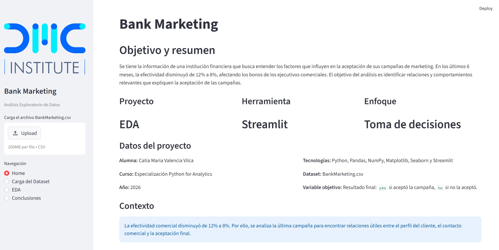
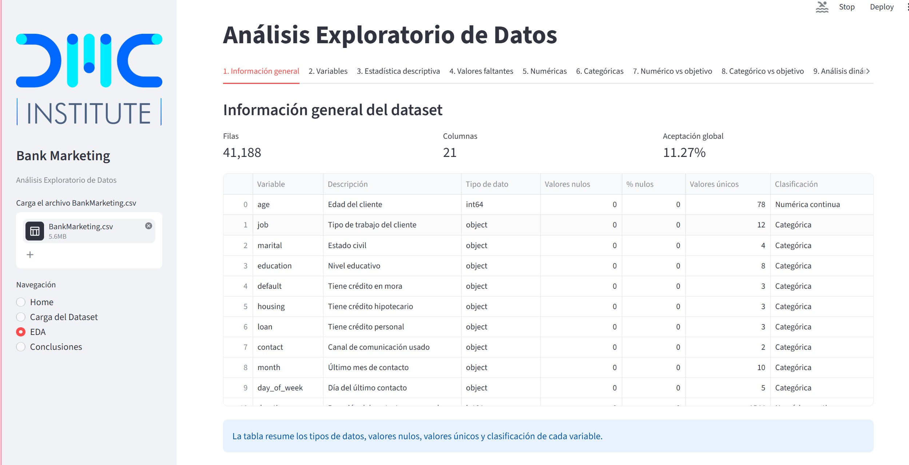
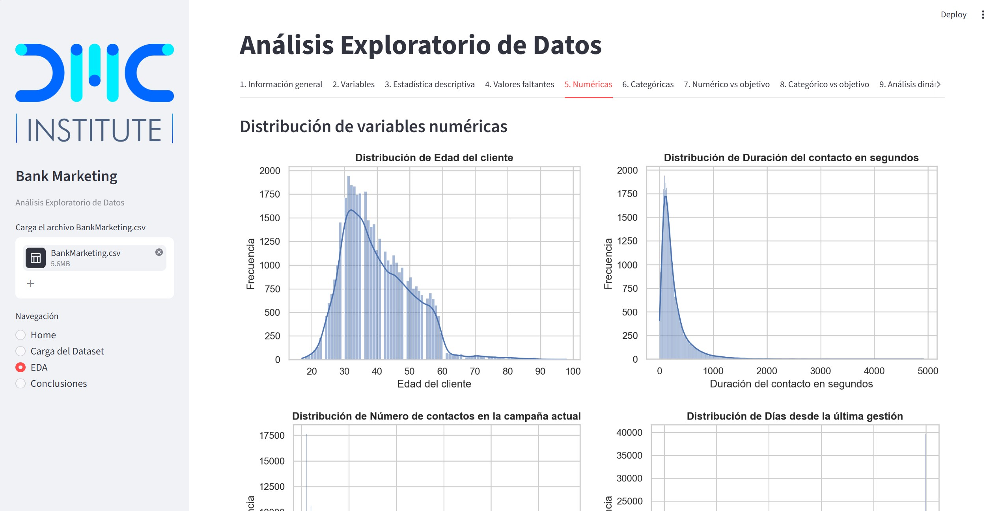
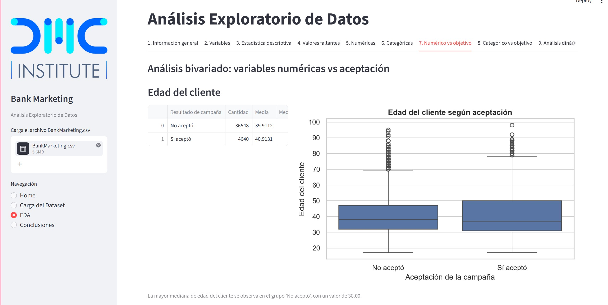
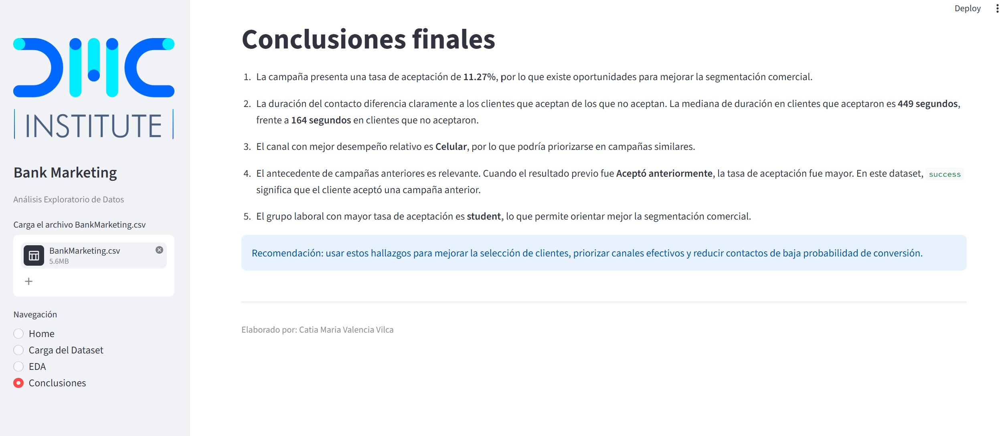

# Proyecto Final - Bank Marketing

## Objetivo

El objetivo del proyecto es realizar un Análisis Exploratorio de Datos (EDA) del caso **BankMarketing**, que evalúa la aceptación de campañas de marketing.  
El análisis busca identificar los principales factores relacionados con la aceptación de dichas campañas por parte de los clientes.

## Tecnologías utilizadas

- Python
- Pandas
- NumPy
- Matplotlib
- Seaborn
- Streamlit

## Dataset

El proyecto utiliza el archivo:

- `BankMarketing.csv`

## Archivos del proyecto

El proyecto contiene los siguientes archivos principales:

- `app_campañas.py`: aplicación principal desarrollada en Streamlit.
- `BankMarketing.csv`: base de datos utilizada para el análisis.
- `requirements.txt`: librerías necesarias para ejecutar el proyecto.
- `DMC.png`: imagen utilizada en la aplicación.
- `Home.jpg`: captura de la pantalla inicial.
- `Carga Dataset.jpg`: captura de la sección de carga del dataset.
- `EDA1.jpg`, `EDA2.jpg`, `EDA3.jpg`: capturas del análisis exploratorio.
- `Conclusiones.jpg`: captura de la sección de conclusiones.

## Funcionalidades

La aplicación permite:

- Cargar dinámicamente el dataset.
- Clasificar automáticamente las variables.
- Revisar estadísticas descriptivas.
- Analizar valores faltantes.
- Evaluar variables numéricas y categóricas.
- Realizar análisis bivariado frente a la variable objetivo.
- Visualizar resultados mediante gráficos.
- Revisar hallazgos e interpretación del dataset.
- Presentar conclusiones finales.

## Instrucciones de ejecución

Para ejecutar el proyecto, primero se deben instalar las librerías necesarias desde el archivo `requirements.txt`:

```bash
pip install -r requirements.txt
```

Luego, desde la carpeta del proyecto, ejecutar:

```bash
streamlit run app_campañas.py
```

Si Streamlit no se reconoce directamente en CMD, ejecutar:

```bash
python -m streamlit run app_campañas.py
```

## Visualización de la aplicación

### Home

La sección **Home** presenta el contexto del problema, el objetivo del proyecto y la información general del estudiante.

Imagen referencial:



### Carga del Dataset

La sección **Carga del Dataset** permite cargar el archivo `BankMarketing.csv`, validar la estructura de la base y revisar el diccionario de variables.

Imagen referencial:


### Análisis Exploratorio de Datos

La sección **EDA** permite identificar las principales características de los clientes que aceptan o no aceptan la campaña.  
Incluye análisis general, clasificación de variables, estadística descriptiva, valores faltantes, análisis numérico, análisis categórico y análisis bivariado.

Imágenes referenciales:







### Conclusiones

La sección **Conclusiones** resume los principales hallazgos encontrados en el análisis y plantea recomendaciones generales para mejorar la segmentación de campañas.

Imagen referencial:



## Conclusión general

El análisis permite identificar patrones relevantes asociados a la aceptación de campañas de marketing, como el canal de contacto, la duración de la interacción, el historial de campañas anteriores y ciertas características del perfil del cliente.  
Estos resultados pueden servir como base para mejorar la segmentación comercial y orientar mejor futuras campañas.
